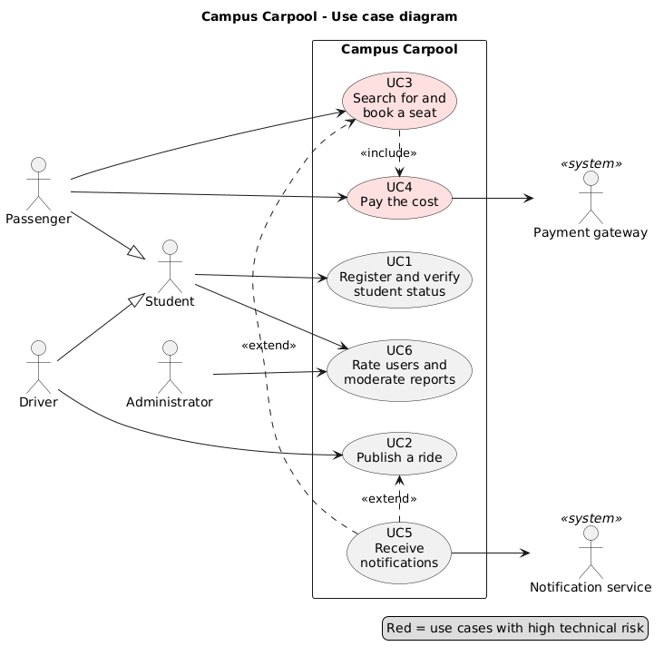

# 4eme-TP-ProcessusUnifies

## Campus Carpooling:

*Covoiturage universitaire: Processus Unifié (UP)*

---

## 1. Vision

- **Problem:** Students commute to campus in cars that run half empty, while others pay for expensive or unreliable transport. Coordination happens in chaotic Facebook or WhatsApp groups with no trust and no guarantees.
- **Users:** Students acting as drivers or passengers, and a university administrator who moderates.
- **Solution:** A platform where verified students publish rides, search for matching routes and schedules, book a seat, and split the cost.
- **Value:** Lower transport costs, fewer cars on the road, and more trust, since only verified university members can join.
- **Scope:** One university, one-off and recurring rides, seat booking with online cost-sharing.

### Actors

| Actor | Type | Role |
|---|---|---|
| **Passenger** | Primary | Searches for rides, books seats, pays |
| **Driver** | Primary | Publishes rides, receives payment |
| **Student** | Generalization | Parent of Passenger and Driver (registration, profile) |
| **Administrator** | Primary | Moderates reports and accounts |
| **Payment gateway** | Secondary (called by the system) | Processes payments and refunds |
| **Notification service** | Secondary (called by the system) | Sends email, SMS or push messages |

---

## 2. Use Cases

| ID | Use case | Technical risk |
|---|---|---|
| UC1 | Register and verify student status (university email) | Medium |
| UC2 | Publish a ride (route, time, seats, price) | Low |
| UC3 | Search for and book a seat | **High:** two passengers booking the last seat |
| UC4 | Pay and share the cost (with refund on cancellation) | **High:** external gateway, double charges, refunds |
| UC5 | Receive notifications (booking confirmed, ride cancelled, reminder) | **Medium-high:** asynchronous delivery, retries |
| UC6 | Rate users and moderate reports (admin) | Low |

Six use cases, three of them carrying technical risk.

---

## 3. Prioritization

Each use case is scored from 1 to 5 on three criteria:

- **Business value:** does the system make sense without it?
- **Risk:** technical or functional uncertainty.
- **Architecture impact:** does it force structural choices (database, locking, external APIs)?

| UC | Business value | Risk | Architecture impact | Total | Rank |
|---|---|---|---|---|---|
| UC3 Book a seat | 5 | 5 | 5 | **15** | 1 |
| UC4 Pay | 4 | 5 | 4 | **13** | 2 |
| UC2 Publish a ride | 5 | 2 | 4 | **11** | 3 |
| UC1 Register / verify | 4 | 3 | 4 | **11** | 3 |
| UC5 Notifications | 3 | 4 | 4 | **11** | 3 |
| UC6 Rate / moderate | 2 | 1 | 2 | **5** | 6 |

### Justification

- **UC3** is the heart of the product and forces the key architectural choices: transactions, locking, and how seats are modeled.
- **UC4** brings in an external dependency and money, so errors are costly.
- **UC2, UC1 and UC5** are tied. UC2 and UC1 are prerequisites for UC3 (no rides and no identity means nothing to book), so minimal versions are built early.
- **UC6** is useful but the system works without it.

**Treat first:** UC3 and UC4, plus minimal versions of UC1 and UC2 as enablers.

---

## 4. Planning: 3 Iterations and the 4 UP Phases

| Iteration | Phase | Content | Milestone |
|---|---|---|---|
| **Pre-iteration** | Inception | Vision, actors, UC list, risk list, prioritization, rough plan | **LCO:** scope and vision validated |
| **Iteration 1** | Elaboration | Architecture (database, API, authentication). UC1 minimal (university-email signup). UC2 basic. **UC3 with atomic seat reservation** (transaction or row lock, tested with concurrent requests). **UC4 prototype** against the gateway's test mode. | **LCA:** architecture stable, top 2 risks retired |
| **Iteration 2 ** | Construction | UC4 complete (payment confirmation, failure handling, refund on cancellation). UC5 (asynchronous notification queue with retries). UC1 and UC2 completed (recurring rides, profile). | **IOC:** beta, all core UCs working |
| **Iteration 3** | Transition | UC6, user testing with real students, bug fixes, deployment, documentation, admin training | **PD:** final release |

**Why this order works:** the two biggest risks, overbooking and payment, are tackled in iteration 1 and finished in iteration 2. If either causes trouble, you find out around week 4, not week 9.

---

## 6. Risk Table

| Risk | Mitigation |
|---|---|
| Two passengers book the last seat | Atomic update or database lock, plus a concurrency test in iteration 1 |
| Payment succeeds but booking fails, or double charge | Payment tied to booking status, idempotency keys, clear rollback flow |
| Notification not delivered | Message queue with retries, fallback channel |
| Fake accounts or unsafe rides | University-email verification, ratings, report button |

---
